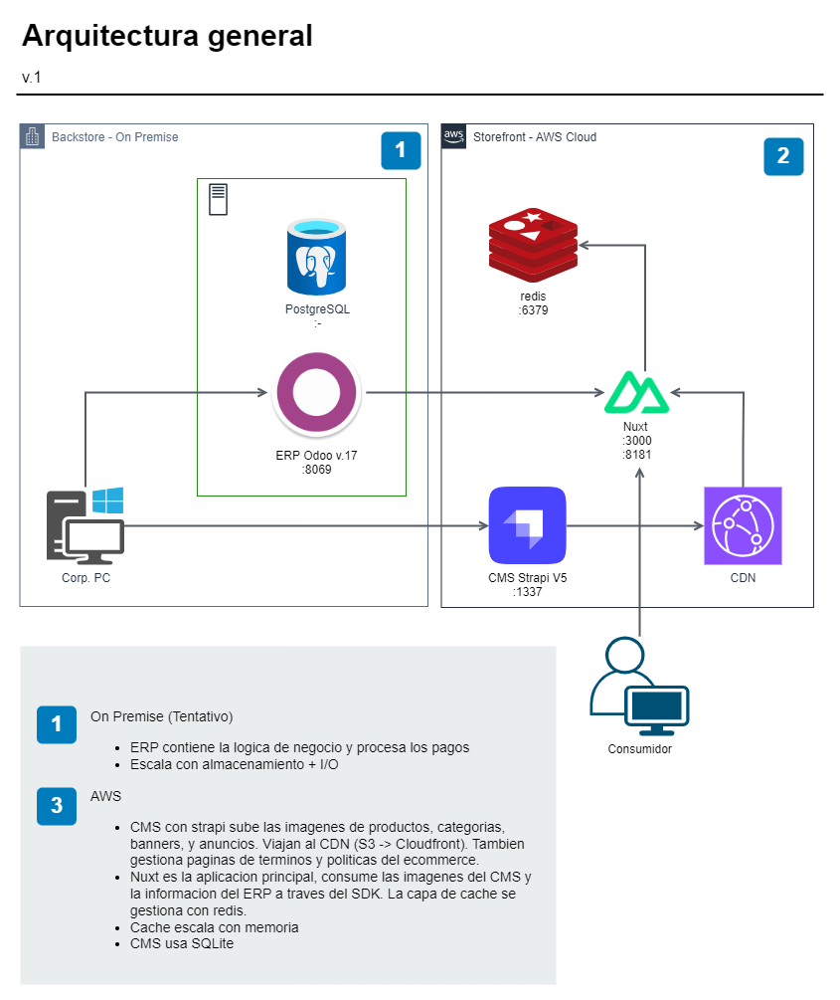

# Storefront

This repo was based on the vue storefront Odoo template to start new projects. It uses its SDK.



## Tech stack

### Storefront

1. Nuxt 3
   1. VSF 2 (SDK)
   2. SFUI-2 (UI)
2. Redis
3. CMS (Strapi in another repo)

## How to start local development ?

> Make sure you have an Odoo Instance

1. Clone the repo
2. Run `yarn install`
3. Copy the `.env.example` to `apps/web/.env`
4. Run `yarn dev`
5. You can access with http://localhost:3000

## Search products

Theres a working database search. Algolia integration is in progress.

### How to configure algolia

1. Set environment variables `NUXT_ALGOLIA_API_KEY` and `NUXT_ALGOLIA_APPLICATION_ID`
2. set `NUXT_ALGOLIA_ENABLED` to `1` or `0` to enable or disabled algolia search.

## Docker

Production mode with docker-compose

```bash
# Test docker build with yarn build before!
docker-compose up --build -d
```
